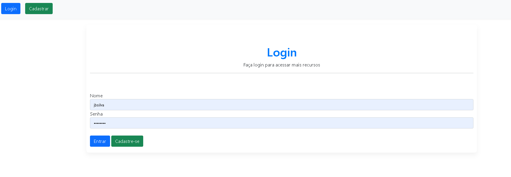
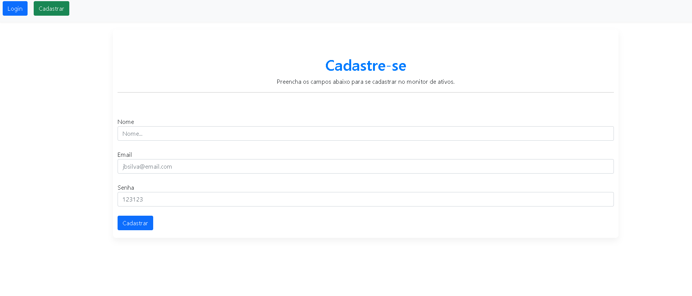
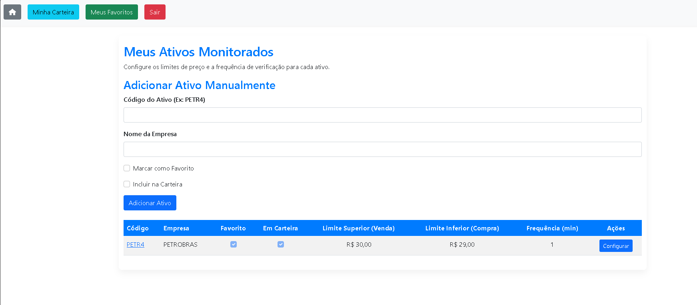
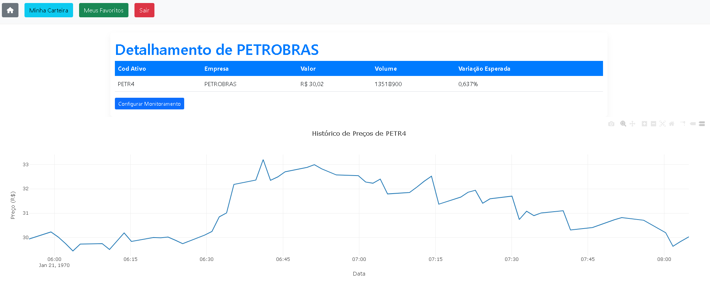
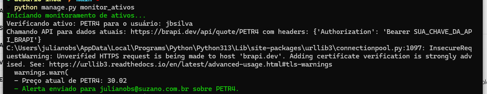
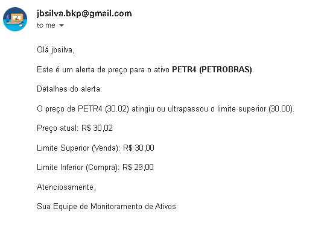

# Desafio INOA - Sistema de Monitoramento de Ativos Financeiros

## Descrição do Desafio

Este projeto consiste no desenvolvimento de uma aplicação web utilizando o framework Django, com o objetivo principal de permitir que usuários monitorem ativos financeiros listados na B3. A aplicação oferece funcionalidades de autenticação, gestão personalizada de ativos, visualização de dados em tempo real e históricos, além de um sistema de alertas por e-mail configurável. O foco é proporcionar uma ferramenta intuitiva para que investidores acompanhem seus ativos e sejam notificados sobre movimentos de preço importantes.

## Funcionalidades Principais

*   **Autenticação de Usuários:** Sistema completo de Cadastro, Login e Logout para gerenciar o acesso à plataforma.
*   **Gestão Personalizada de Ativos:**
    *   **Adição Manual:** Usuários podem adicionar ativos financeiros à sua lista de monitoramento informando o código do ativo e o nome da empresa.
    *   **Categorização:** Marcar ativos como "Favoritos" ou incluí-los em "Minha Carteira" para uma organização personalizada.
    *   **Configuração de Limites:** Definir `limite_superior` (sugestão de venda) e `limite_inferior` (sugestão de compra) para cada ativo.
    *   **Frequência de Verificação:** Configurar o `intervalo_verificacao` (em minutos) para determinar a periodicidade do monitoramento. Um valor de `0` (zero) desativa o monitoramento para aquele ativo.
    *   **Exclusão Segura:** Remover ativos da lista de monitoramento com uma confirmação de senha para garantir a segurança.
*   **Visualização Detalhada de Ativos:**
    *   **Página Home (`/ativos_user/`):** Exibe todos os ativos que o usuário está monitorando, com opções de busca e configuração rápida.
    *   **Minha Carteira (`/ativos_user/carteira/`):** Lista apenas os ativos marcados como "Em Carteira".
    *   **Meus Favoritos (`/ativos_user/favoritos/`):** Apresenta somente os ativos definidos como "Favoritos".
    *   **Página de Detalhes (`/ativos_user/detalhes/<id>/`):** Oferece informações atuais do ativo (preço, volume, variação) e um gráfico interativo com o histórico de preços, utilizando dados da API `brapi.dev`.
*   **Sistema de Monitoramento e Alertas por E-mail:**
    *   **Comando de Gerenciamento:** Um comando `manage.py monitor_ativos` verifica periodicamente os preços dos ativos configurados.
    *   **Alertas Inteligentes:** Envia e-mails de alerta para o investidor sugerindo compra (se o preço cruzar o limite inferior) ou venda (se o preço cruzar o limite superior).
    *   **Prevenção de Spam:** O sistema controla a frequência de envio de e-mails para o mesmo ativo, evitando notificações excessivas.

## Configuração do Ambiente de Desenvolvimento

Siga os passos abaixo para configurar e executar o projeto em sua máquina local.

### 1. Clonar o Repositório e Criar Ambiente Virtual

```bash
# Substitua <URL_DO_SEU_REPOSITORIO> pela URL do seu repositório Git
git clone https://github.com/JBSilvaDev/desafio-inoa
cd desafio-inoa
python -m venv venv
```

### 2. Ativar o Ambiente Virtual

É fundamental ativar o ambiente virtual em cada nova sessão do terminal antes de executar comandos do projeto.

*   **Windows:**
    ```bash
    .\venv\Scripts\activate
    ```
*   **Linux/macOS:**
    ```bash
    source venv/bin/activate
    ```

### 3. Instalar Dependências

Com o ambiente virtual ativado, instale todas as bibliotecas Python necessárias:

```bash
pip install -r requirements.txt
```

### 4. Configurar Variáveis de Ambiente (`.env`)

Para proteger informações sensíveis e facilitar a configuração, o projeto utiliza variáveis de ambiente.

1.  **Crie o arquivo `.env`:** Na raiz do projeto (na mesma pasta do `manage.py`), crie um arquivo chamado `.env`.
2.  **Preencha com suas credenciais:** Copie o conteúdo do arquivo `.env.example` para o seu novo arquivo `.env` e preencha com suas credenciais reais.

```ini
# Conteúdo de exemplo para o seu arquivo .env
# Renomeie este arquivo para .env e preencha com suas credenciais.

# Configurações de E-mail (Gmail SMTP)
# Para EMAIL_HOST_PASSWORD, use uma "senha de aplicativo" gerada no Google.
# Veja como gerar: https://support.google.com/accounts/answer/185833
EMAIL_HOST=smtp.gmail.com
EMAIL_PORT=587
EMAIL_USE_TLS=True
EMAIL_HOST_USER=seu_email@gmail.com
EMAIL_HOST_PASSWORD=sua_senha_de_aplicativo
DEFAULT_FROM_EMAIL=seu_email@gmail.com

# Chave da API brapi.dev
# Obtenha sua chave gratuita em https://brapi.dev/
BRAPI_API_KEY=SUA_CHAVE_DA_API_BRAPI
```

**Como obter os valores necessários:**

*   **`EMAIL_HOST_USER` e `DEFAULT_FROM_EMAIL`:** Seu endereço de e-mail do Gmail.
*   **`EMAIL_HOST_PASSWORD` (Senha de Aplicativo do Gmail):**
    1.  Acesse sua [Conta Google](https://myaccount.google.com/).
    2.  Navegue até a seção "Segurança".
    3.  Em "Como fazer login no Google", clique em "Senhas de app". (Se esta opção não estiver visível, certifique-se de que a [Verificação em duas etapas](https://myaccount.google.com/security) esteja ativada para sua conta).
    4.  Siga as instruções para gerar uma nova senha de aplicativo. Utilize essa senha no seu arquivo `.env`.
*   **`BRAPI_API_KEY`:**
    1.  Visite o site da [brapi.dev](https://brapi.dev/).
    2.  Crie uma conta gratuita e obtenha sua chave de API.

### 5. Migrações do Banco de Dados

Aplique as migrações para configurar o banco de dados do projeto:

```bash
python manage.py makemigrations
python manage.py migrate
```

### 6. Criar Superusuário (Opcional)

Para acessar o painel administrativo do Django, crie um superusuário:

```bash
python manage.py createsuperuser
```

### 7. Executar o Servidor de Desenvolvimento

Inicie o servidor web do Django:

```bash
python manage.py runserver
```

Acesse a aplicação em seu navegador: `http://127.0.0.1:8000/`

## Monitoramento de Ativos (Tarefa em Segundo Plano)

Para que o sistema monitore os ativos e envie alertas automaticamente, você precisa agendar a execução do comando `monitor_ativos` periodicamente no seu sistema operacional.

### Execução Manual (para Testes e Desenvolvimento)

Para testar a funcionalidade de monitoramento e alertas, execute o comando abaixo em um terminal separado (com o ambiente virtual ativado):

```bash
python manage.py monitor_ativos
```

### Agendamento em Produção (Exemplos)

#### Windows Task Scheduler

1.  Abra o "Agendador de Tarefas" (Task Scheduler) no Windows.
2.  No painel "Ações", clique em "Criar Tarefa Básica..." (Create Basic Task...).
3.  **Nome e Descrição:** Dê um nome e uma descrição claros para a tarefa (ex: "Monitoramento de Ativos INOA").
4.  **Gatilho:** Escolha a frequência desejada (ex: "Diariamente", "Semanalmente", ou configure um gatilho mais avançado para "A cada X minutos").
5.  **Ação:** Selecione "Iniciar um programa" (Start a program).
6.  **Configurações da Ação:**
    *   **Programa/script:** Coloque o caminho completo para o executável do Python dentro do seu ambiente virtual. Exemplo:
        ```
        C:\caminho\para\seu\projeto\venv\Scripts\python.exe
        ```
    *   **Adicionar argumentos (opcional):**
        ```
        manage.py monitor_ativos
        ```
    *   **Iniciar em (opcional):** Coloque o caminho completo para a raiz do seu projeto. Exemplo:
        ```
        C:\caminho\para\seu\projeto\desafio-inoa
        ```
7.  Finalize a criação da tarefa.

#### Linux/macOS (Cron)

1.  Abra o terminal.
2.  Edite o crontab (tabela de agendamento de tarefas):
    ```bash
    crontab -e
    ```
3.  Adicione a seguinte linha para executar o comando a cada minuto (ajuste a frequência conforme necessário). Lembre-se de substituir `/caminho/para/seu/projeto/` pelo caminho real do seu projeto.
    ```bash
    * * * * * /caminho/para/seu/projeto/venv/bin/python /caminho/para/seu/projeto/manage.py monitor_ativos >> /caminho/para/seu/projeto/monitor_log.log 2>&1
    ```
    *   `>> /caminho/para/seu/projeto/monitor_log.log 2>&1` redireciona a saída padrão e de erro do comando para um arquivo de log, o que é altamente recomendado para depuração em ambientes de produção.

## Telas da Aplicação

### 1. Tela de Login


### 2. Tela de Cadastro


### 3. Página Home - Meus Ativos


### 4. Página de Detalhes do Ativo


### 5. Output do Comando de Monitoramento no Terminal


### 6. Exemplo de E-mail de Alerta Recebido
